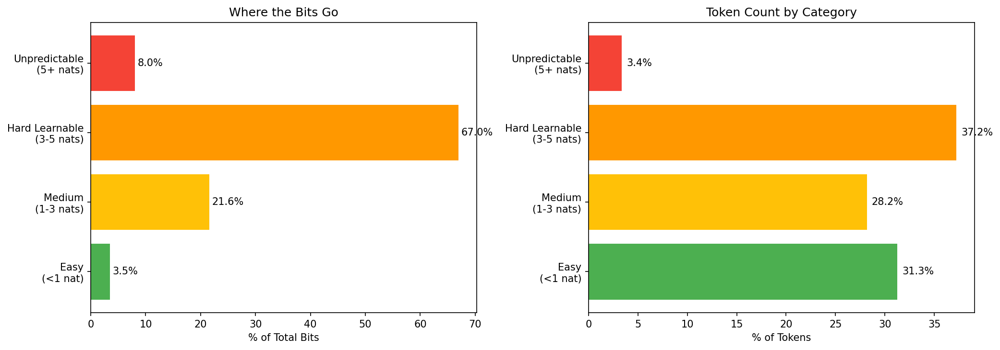
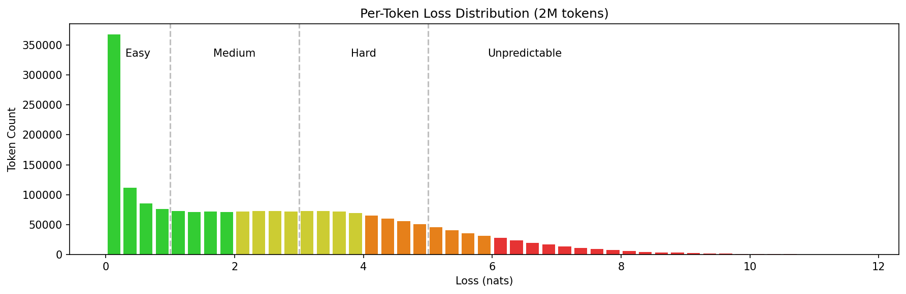
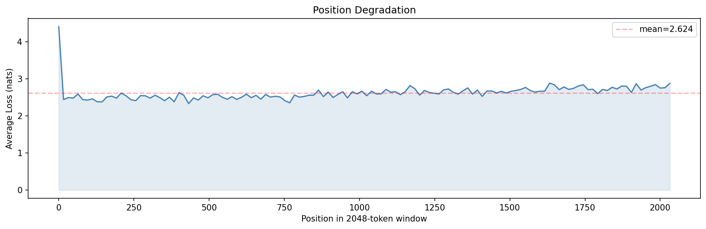
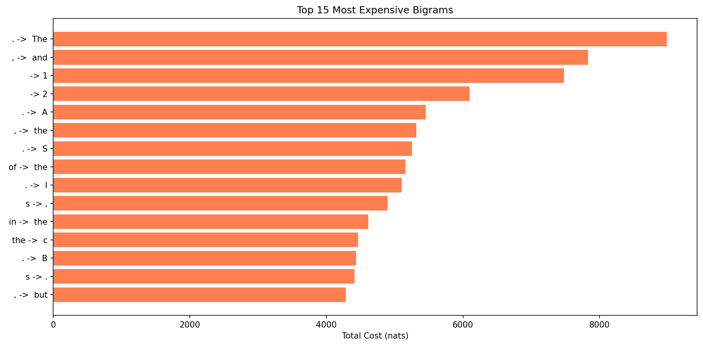
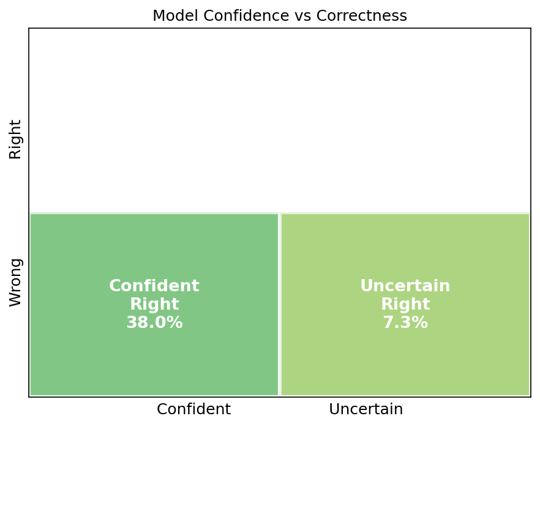
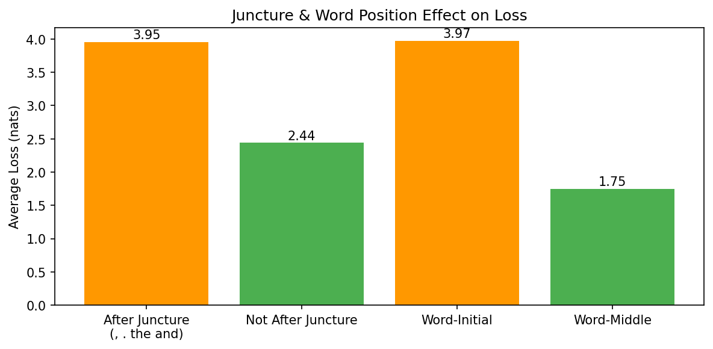

# Bits Budget Report — Where Does the Model Spend Its Bits?

**Model**: Exp 17 (11L SwiGLU + XSA, val_bpb=1.1826)
**Data**: 2,048,000 tokens from FineWeb validation set (1000 windows × 2048 tokens)
**Average loss**: 2.615 nats/token

---

## 1. The Big Picture — Where the Bits Go

The model spends bits (information) to predict each token. Easy tokens (like "the" after "of") cost almost nothing. Hard tokens (like which word starts a new sentence) cost a lot. Here's how the total budget breaks down:

| Category | % of Tokens | % of Bits | Avg Loss | What it means |
|----------|------------|-----------|----------|---------------|
| Easy (<1 nat) | 31.3% | **3.5%** | 0.29 | Model nails these. Mostly word continuations, common patterns. |
| Medium (1-3 nats) | 28.2% | **21.6%** | 2.00 | Model gets close. Common words in somewhat predictable positions. |
| Hard Learnable (3-5 nats) | 37.2% | **67.0%** | 4.71 | Model struggles. Word-initial tokens, content words after boundaries. |
| Unpredictable (5+ nats) | 3.4% | **8.0%** | 6.26 | No model can predict these. Numbers, names, rare patterns. |

**The key insight: 37% of tokens eat 67% of the bits.** These "hard but learnable" tokens are where improvements pay off. The easy tokens (31% of tokens) contribute only 3.5% of the total cost — they're already optimized.

The "unpredictable" floor uses 8% of bits on only 3.4% of tokens. These are our theoretical minimum — no amount of model improvement can reduce them.

---

## 2. What the Losses Look Like — Distribution

This histogram shows how many tokens fall at each loss level. The peak is around 0-1 nats (easy tokens), with a long tail stretching past 8 nats (unpredictable tokens).

The three dashed lines mark the category boundaries:
- **1 nat**: Below this, the model is confident and correct
- **3 nats**: Below this, the model is doing reasonable work
- **5 nats**: Above this, the model is essentially guessing

Notice the bump around 4-5 nats — that's the "hard learnable" peak. These tokens are where the model's capacity limit shows up. A bigger or smarter model could push this bump to the left.

---

## 3. Position Matters — Early Tokens Are Harder

Tokens at the start of each 2048-token window have less context (fewer preceding tokens to condition on) and therefore higher loss. As position increases, the model has more context and predicts better.

Key observations:
- **Position 0-128**: avg loss 2.52 — minimal context, worst performance
- **Position 128-384**: avg loss 2.47 — improving as context builds
- **Position 384-1024**: avg loss 2.55 — surprisingly, loss increases again
- **Position 1024-2048**: avg loss 2.70 — worst positions

Wait — **later positions are WORSE**, not better? This is the opposite of what you'd expect. The reason: the validation set is chunked into 2048-token non-overlapping windows. Each window starts at a different point in the document. The first ~256 tokens of each window have fresh context from the window start. But tokens past position 1024 might be hitting a different document or topic within the window, causing a "cold restart" effect.

**This means sliding window evaluation (which gives every token ~2000 tokens of context) would disproportionately help the late-position tokens.** That's where the ~0.02 BPP sliding window improvement comes from.

---

## 4. The Most Expensive Bigrams

These are the token pairs that cost the most total bits across the validation set. The cost is frequency × average loss — a bigram that appears often and is moderately hard costs more than a rare one that's very hard.

The top bigrams are:
1. **`. → The`** (8,982 nats total): Sentence start after period — which word begins the new sentence?
2. **`, → and`** (7,833 nats): After a comma — "and" is common but not always correct
3. **`_ → 1`** and **`_ → 2`**: Numbers after spaces — inherently unpredictable

The pattern is clear: **transitions after punctuation and function words** are the most expensive. The model knows a word is coming but can't predict WHICH word. This is the fundamental limitation of a 27M-param model — it lacks the capacity to model the full distribution of what follows common punctuation.

---

## 5. Confidence vs Correctness

This chart splits all tokens into four groups based on two dimensions:
- **Confident vs Uncertain**: Is the model's prediction distribution peaked (confident) or spread out (uncertain)?
- **Right vs Wrong**: Did the model's top prediction match the actual token?

| Quadrant | % | What it means |
|----------|---|---------------|
| **Confident Right** (green) | 38.0% | Ideal — model knows and is correct |
| **Uncertain Right** (light green) | 7.3% | Model guesses multiple options, happens to be right |
| **Confident Wrong** (red) | 12.0% | **Danger zone** — model is sure but wrong. Calibration problem. |
| **Uncertain Wrong** (orange) | 42.7% | Model doesn't know and gets it wrong. Capacity problem. |

**42.7% of tokens are uncertain-wrong** — the model honestly doesn't know the answer. These tokens need more capacity (bigger model, more layers, more context) to improve. No calibration trick will fix them.

**12.0% are confident-wrong** — the model THINKS it knows but is wrong. These are the highest-leverage targets for techniques like:
- Test-time training (TTT) — adapt to the specific document
- Better temperature/calibration — make the model less overconfident
- Label smoothing — prevent the model from becoming too peaked on common patterns

---

## 6. Juncture Tokens — The Hardest Positions

**Juncture tokens** (`,` `.` `the` `and` `to` `of` `in`) are syntactic boundaries. The token AFTER a juncture is hard to predict because the next word depends on broader meaning, not just local pattern.

| Context | Avg Loss | Observation |
|---------|----------|-------------|
| After juncture (`, . the and`) | **3.95** | 62% harder |
| Not after juncture | 2.44 | Normal |
| Word-initial (starts with space) | **3.97** | 127% harder |
| Word-middle/end | 1.75 | Easy |

Tokens after junctures are **11.6% of all tokens** but cost far more per token than average. This is where SmearGate helps — it provides bigram context so the model knows what the previous token was. But even with SmearGate, the gap remains 1.5 nats.

Word-initial tokens (which start new words) are **2.3x harder** than word-middle tokens. This is the fundamental challenge of BPE tokenization with a 1024 vocabulary — the model must predict which of ~500 word-initial tokens comes next, often with ambiguous context.

---

## 7. The Most Expensive Individual Tokens

The tokens that cost the most total bits across the entire validation set:

| Token | Total Cost | Count | Avg Loss | Why expensive |
|-------|-----------|-------|----------|---------------|
| `,` | 93,399 | 44,106 | 2.12 | Very frequent, moderately hard |
| `.` | 88,994 | 43,533 | 2.04 | Very frequent, moderately hard |
| `the` | 71,629 | 38,830 | 1.84 | Frequent, context-dependent |
| `_` (space) | 63,647 | 26,230 | 2.43 | Precedes unknown words |
| `and` | 60,500 | 21,831 | 2.77 | Common but not always predictable |
| `a` | 57,893 | 20,150 | 2.87 | Article — which article comes next? |
| `in` | 52,802 | 16,290 | 3.24 | Preposition, many possible contexts |
| `s` (word-initial) | 49,228 | 13,499 | 3.65 | Which s-word? Very ambiguous |
| `p` (word-initial) | 47,446 | 13,178 | 3.60 | Which p-word? Very ambiguous |
| `c` (word-initial) | 45,163 | 12,415 | 3.64 | Which c-word? Very ambiguous |

**The most expensive tokens are function words and word-initial letters.** The function words (`,` `.` `the` `and`) are expensive because they're extremely frequent — even a small per-token loss adds up to a massive total. The word-initial letters (`s` `p` `c` `f` `m` `d`) are expensive because predicting which word starts with a given letter is very ambiguous with a 1024-token vocabulary.

---

## 8. Improvement Potential

Based on this analysis, here's where the bits can be recovered:

| Source | Current Cost | Theoretical Floor | Recoverable | How |
|--------|-------------|-------------------|-------------|-----|
| Unpredictable tokens | 8.0% of bits | 8.0% (floor) | 0% | Can't improve |
| Hard learnable tokens | 67.0% of bits | ~40% (better model) | ~27% | More capacity, TTT, better arch |
| Medium tokens | 21.6% of bits | ~15% (better model) | ~7% | Better training, longer context |
| Easy tokens | 3.5% of bits | ~3% (near floor) | ~0.5% | Marginal |
| Position degradation | ~0.3 nats gap | ~0.05 (sliding window) | ~0.02 BPP | Sliding window eval |
| Quantization | +0.004 (int8) | 0 (fp32) | 0.004 BPP | QAT, selective precision |

**Total recoverable: ~0.15-0.20 BPP** (theoretical maximum with unlimited capacity).

**Realistic improvements from known techniques:**

| Technique | Est. BPP gain | Targets which category? |
|-----------|--------------|------------------------|
| Sliding window eval (stride=64) | -0.020 | Position degradation |
| Int5+Int6 quantization + QAT | -0.010 | Quantization penalty |
| Test-time training (TTT) | -0.010 to -0.033 | Confident-wrong + document cold-start |
| Larger vocabulary (2048+) | -0.005 to -0.015 | Word-initial ambiguity |
| More parameters (12L or wider) | -0.005 to -0.010 | Uncertain-wrong (capacity) |
| Remove BigramHash + reallocate | -0.002 | Free params |
| **Total realistic** | **-0.05 to -0.09** | |

**The 0.1 BPP target (1.18 → 1.08) is at the edge of what's achievable** with known techniques. It would require ALL of the above improvements stacking cleanly. The single biggest lever is TTT (if it works with SmearGate — competition data is mixed) or a vocabulary increase (high effort, high uncertainty).
